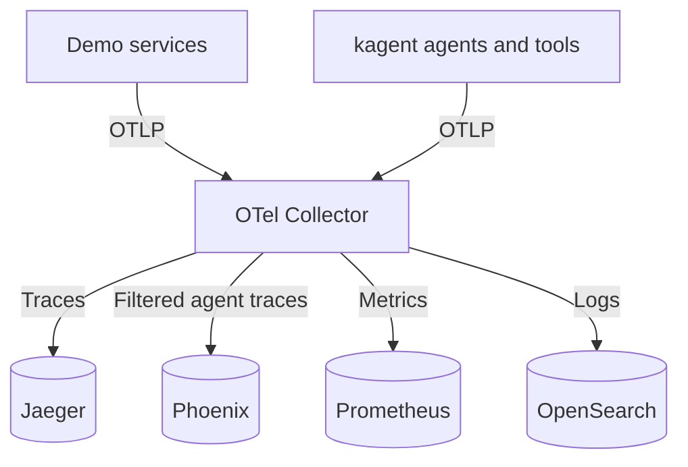
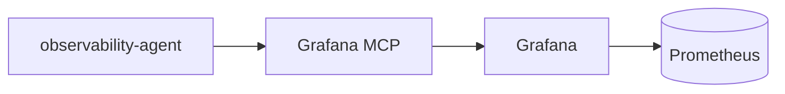

# Lab 6: Observability

Deployed OpenTelemetry Demo alongside kagent, investigated three faults and inspected agent telemetry. Branch: [`lab/06-observability`](https://github.com/vanelin/abox/tree/lab/06-observability). Selected upstream changes: `feat/otel-demo` at `a6c01c5`. Results recorded on 2026-09-20.

| Lab task | Result |
|---|---|
| 1. Deploy and understand the demo | Running demo; traced checkout and Kafka processing |
| 2. Exercise the product | Three fault investigations with metrics, traces and logs — [demo results](demo.md) |
| 3*. Connect kagent | Agent traces in Jaeger/Phoenix, logs in OpenSearch, Grafana MCP investigation — [agent results](observations.md) |

## Architecture

Telemetry flows through the Collector:

Prometheus also receives request-rate, error and duration metrics derived from spans. Phoenix receives kagent traces with controller API polling excluded.

The observability agent queries metrics through Grafana; results return along the same path:

## Final configuration

| Component | Version | Lab configuration |
|---|---|---|
| OpenTelemetry Demo | Chart 0.41.2 / app 3.0.0 | Collector pipeline fix, Phoenix export, increased backend memory limits |
| kagent | 0.10.1 | Tracing, logging and Grafana MCP enabled |
| Phoenix | Chart 12.0.14 | Authentication disabled; private lab access |
| agentgateway-llm | v1.5.0 | Gemini through Google's OpenAI-compatible API; no Collector export |
| ngrok-operator | Chart 0.24.0 | Installed; no endpoint published |
| xray-memory | Chart 0.6.0 | Retained after the 0.6.3 image could not be pulled |

Qdrant, Neo4j, the standalone embedding service, llm-d and Qdrant retrieval agents were excluded to reduce resource use. Their manifests remain in the repository.

## Access

Run `make run` with `OPENAI_API_KEY`, `GEMINI_API_KEY`, `SOPS_AGE_KEY`, `NGROK_API_KEY` and `NGROK_AUTHTOKEN` available in the environment. Prefix each command below with `kubectl -n <namespace> port-forward`.

| Interface | Namespace | Service and ports | Path |
|---|---|---|---|
| Shop and demo tools | `otel-demo` | `svc/frontend-proxy 8086:8080` | `/`, `/grafana/`, `/jaeger/ui/`, `/feature/` |
| kagent | `kagent` | `svc/kagent-ui 8080:8080` | `/` |
| Phoenix | `phoenix` | `svc/phoenix-svc 6006:6006` | `/` |
| Gateway admin | `agentgateway-system` | `svc/agentgateway-llm 15000:15000` | `/ui` |
| Gateway LLM API | `agentgateway-system` | `svc/agentgateway-llm 8087:80` | `/v1/chat/completions` |

Keep forwarded ports private. These interfaces expose telemetry, configuration or model access. In the final configuration, gateway admin and LLM traffic use separate ports; the browser Playground is not a verified access path.

## Main findings and limits

Traces explained failures that aggregate metrics or agent answers obscured. The observability agent queried live data but produced incorrect percentages and attribution. Telemetry backends also failed under resource pressure.

Results come from a small set of manual runs. The shipping test overlapped another fault, some logs were lost after restarts, and sustained stability after reducing the workload was not verified. Go/Python comparison and dedicated agent dashboards were not completed.
