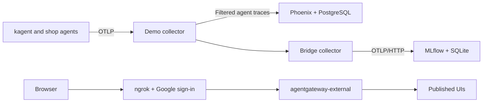

# Lab 7: GenAI observability — Phoenix vs MLflow

Branch: `lab/07-olly`, based on the instructor's `feat/otel-demo` (`ce50380`).

## Results

- Connected kagent and the OpenTelemetry Demo's shop agent to Phoenix and MLflow through OpenTelemetry collectors.
- Published kagent, Phoenix, MLflow, Qdrant, xray-memory and the demo's chatbot and feature flags through one ngrok domain with Google sign-in.
- Compared 15 traces from 14 test messages covering retrieval, delegation, chat history, memory writes and a failed tool call. Both backends received all 15 traces; token totals matched in 14. MLflow was missing two spans in the remaining trace.
- Both backends exposed tool calls and errors. Phoenix used less memory in this setup; neither backend could determine whether an agent had completed every requested task.

Detailed results and limitations: [comparison.md](comparison.md).

## Setup



| Component | Version / configuration |
|---|---|
| MLflow | 3.14, chart 0.1.0; separate `kagent` and `otel-demo` experiments |
| Phoenix | chart 12.0.14; project `default` |
| Bridge collector | 0.160.0; routes traces to MLflow and filters background traffic |
| OpenTelemetry Demo | chart 0.41.2; load generator starts paused |
| ngrok-operator | 0.24.0; Google sign-in restricted to one account |

Qdrant, Neo4j, llama-cpp-embeddings and llm-d are enabled. Jaeger, Prometheus, Grafana and OpenSearch are disabled to fit the Codespace, so this lab compares Phoenix and MLflow only.

## Access

Base URL: https://cape-lethargic-sizing.ngrok-free.dev

| Path | UI |
|---|---|
| `/` | kagent |
| `/mlflow/` | MLflow |
| `/phoenix/` | Phoenix |
| `/chatbot/` | Shop chatbot |
| `/feature/` | Feature flags |
| `/qdrant/dashboard` | Qdrant |
| `/xray/ui` | xray-memory |

Access requires the allowed Google account. The storefront is not published; Neo4j still uses a port-forward. The published Qdrant and xray endpoints allow writes, so the sign-in restriction matters.

## Reproduce

The UIs use ngrok. The test script connects directly to kagent through a local port-forward:

```bash
kubectl -n kagent port-forward svc/kagent-controller 8083:8083 &
uv run docs/labs/07/scripts/runs.py
```

The script ingests test objects and writes a memory note. Answers are saved to `.local/lab07/runs.json`. Find the corresponding traces by time in Phoenix and MLflow.

## Limits

This was one test batch, not a performance benchmark. The shop agent uses recorded LLM responses. Prometheus and Grafana are off, so `observability-agent` cannot query them. Resource measurements and trace-delivery limitations are recorded in [comparison.md](comparison.md).
