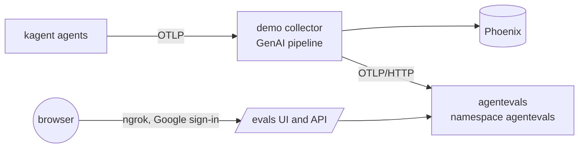

# Lab 8: Evaluating our agents with agentevals-go

[agentevals-go](https://github.com/triageagent-dev/evals) scores agent behaviour from OpenTelemetry traces, without re-running the agent. Our copy of it, upstream `54107cf` plus the fixes this lab needed, is [agentevals/](../../../agentevals/) in the repository root ([what we changed](../../../agentevals/ABOX.md)). kagent's Go ADK traces are its native input: the repo's own samples are kagent `helm-agent` traces.

## Setup

Everything runs in the cluster, from git, like the other labs (released as v0.6.28).



| Piece | Where |
|---|---|
| Image | `make -C agentevals push`, run by [.github/workflows/agentevals-image.yaml](../../../.github/workflows/agentevals-image.yaml) after `go test ./...`; UI built for `/evals`. Upstream publishes no image |
| Server | [releases/agentevals.yaml](../../../releases/agentevals.yaml): Deployment, Service, a PVC for sessions, eval sets and run history, HTTPRoute `/evals` |
| Traces in | a third exporter in the demo collector's GenAI pipeline, next to Phoenix ([releases/opentelemetry-demo.yaml](../../../releases/opentelemetry-demo.yaml)) |
| Judge | model from `AGENTEVALS_JUDGE_MODEL` in the release (`gemini-3.8-flash`); key `agentevals/agentevals-gemini` from `GEMINI_API_KEY`, made by `scripts/secrets.sh`, optional |
| UI | `https://cape-lethargic-sizing.ngrok-free.dev/evals/` |

## Working with it

1. Ask an agent in kagent (`/`), one question per new chat. The run appears as a session in `/evals`, Live Agent Sessions.
2. Click the session to use as the golden and tick Compare on the runs to score, then Continue to Evaluation. With nothing ticked, the golden session is scored against itself.
3. Check the golden answer against the source (the corpus, the manifests). If it is wrong, click the eval set file name, correct Final Response and Apply Changes; the tool calls stay those of the session.
4. Pick the judge, the match type and the metrics, and run. Run history is kept on the PVC.

Rubric metrics need rubric text, which the UI cannot take yet, so they go through the API (`kubectl -n agentevals port-forward svc/agentevals 8001`; a session's trace comes from `POST /api/streaming/get-trace` with `{"session_id": ...}`):

```bash
curl -F trace_files=@trace.jsonl -F eval_set_file=@evalset.json \
  -F 'config={"evaluators":[{"type":"builtin","name":"rubric_based_final_response_quality_v1","rubrics":["Answers the question directly"]}]}' \
  localhost:8001/api/evaluate
```

## Results

### In the cluster

`retrieval-agent-xray`, "Which repositories use Terraform?", three runs in new chats, judge `gemini-3.8-flash`, trajectory ANY_ORDER. All three made the same calls: `recall`, `search_graph` (20 of 27 repositories), then `get_graph_node` on the same four repositories. All three missed `abox`, which was among the search results, and two claimed 27 Terraform repositories: 27 is the number of all repositories in the map. No run could be the golden as it was, so the golden is one run with its answer corrected to the five repositories.

| Golden answer | Scored run | trajectory | final response v2 |
|---|---|---|---|
| corrected: five repositories | `01a0e429` | 1 PASS | **0 FAIL** |
| corrected: five repositories | `01a0e42a` (the golden run itself) | 1 PASS | **0 FAIL** |
| the run's own, unchecked | `01a0e429` | 1 PASS | **1 PASS** |
| the run's own, unchecked | `01a0e42a` | 1 PASS | **1 PASS** |

Same traces, same judge: only the golden answer changed the verdict. Trajectory passed every run, since all took the same path to the same incomplete answer.

Pushed in the same chat, the agent found `abox` on the sixth turn and explained: "I stopped at the first high-signal hits instead of reading the full repo set". It still called all 27 repositories Terraform matches. Such a session cannot be the golden for one-turn runs: trajectory needs the same number of turns.

Sessions and run history survived a pod restart.

### Fixing the agent

The traces showed why: the prompt already told the agent to answer "which repositories use Terraform" with `get_graph_impact` from the Terraform node, but its search rules came first, and every run searched instead. The prompt ([releases/agent-memory.yaml](../../../releases/agent-memory.yaml)) was changed twice; after each change the question was asked three times in new chats and scored against a correct run of that round, unedited.

| Prompt | Path | Complete lists (5 repositories) | Other runs pass response match | Other runs pass trajectory |
|---|---|---|---|---|
| before | search, then four repositories opened | 0 of 3 | 0 of 2 (checked golden) | 2 of 2 |
| v1: lists come from graph relations; a search count is not a match count | `get_graph_impact`, 3 of 3 | 1 of 3: `tf-google-gke-cluster`, the last item, dropped twice | 0 of 2 | 1 of 2 |
| v2: the seed is counted at depth 0; every depth-1 node is a repository | `get_graph_impact`, 3 of 3 | 3 of 3 | 2 of 2 | 0 of 2 |

v2 is not flawless: one run opened with "4 repositories" above a list of five, another added "12 Tool nodes", misread from the search note. The judge passed both, since all five names were there.

Trajectory failed both correct v2 runs, and one correct-path v1 run, on an argument the model picks freely: `limit` 10 or 20 where the golden had 20 or 5. It flagged the switch from search to the graph, but with exact argument matching it cannot gate a regression run.

### Prototype round

From the prototype round: upstream's build as a process in the Codespace, fed by the collector through the KinD gateway; each question asked twice, the better-looking run saved as the eval set and the other scored through the API. It also found the gzip and judge-model gaps below, now fixed in our copy.

| Agent, question | Scored run vs golden | trajectory | final response v2 | rubric quality | hallucinations |
|---|---|---|---|---|---|
| `retrieval-agent-xray`, "Which repositories use Terraform?" | "I found **27** total…" vs "I found 4…" | **0** FAIL | 1 PASS | 1 PASS | 0.14 FAIL |
| `retrieval-agent-nomic`, "Which agents use … default-model-config?" | `helm-agent` vs `helm-agent` | 1 PASS | 1 PASS | 1 PASS | **0** FAIL |
| `retrieval-agent`, "Which model does k8s-agent use?" | empty answer vs `openai-gpt-5-4-nano` | error: *No invocations extracted from trace* | | | |

Built-in metrics used: `tool_trajectory_avg_score` (ANY_ORDER), `final_response_match_v2`, `rubric_based_final_response_quality_v1` (one rubric: answers directly, names the items), `hallucinations_v1`.

The golden runs were checked against the source only afterwards, and none was fully right:

| Question | Golden run said | Correct | Source |
|---|---|---|---|
| Terraform repositories | 4, without `abox` | 5: `abox`, `alternat`, `automation-token-update`, `tf-gcp-gke-cluster-flux`, `tf-google-gke-cluster` | lab 5 gold `g01` in [questions.json](../05/data/questions.json); the corpus links `abox` to Terraform |
| Agents on `default-model-config` | `helm-agent` only | in the cluster, the chart's five agents: `helm-agent`, `kgateway-agent`, `promql-agent`, `observability-agent`, `argo-rollouts-conversion-agent` | kagent chart 0.10.1 rendered with [releases/kagent.yaml](../../../releases/kagent.yaml) |
| Model of `k8s-agent` | config `openai-gpt-5-4-nano`, then `gpt-4.1-mini` from `default-model-config` | `openai-gpt-5-4-nano`, model `gpt-5.4-nano` | [agent-retrieval.yaml](../../../releases/agent-retrieval.yaml), [model-configs.yaml](../../../releases/model-configs.yaml) |

The nomic answer claims only what its store returned, and the lab 4 ingest skips the chart's agents, so the store likely lacks the other four: a gap in the corpus, not a made-up answer. A golden has to match what the agent can know.

So the scores above measure agreement with a flawed run, not correctness. They stay as an experiment on unchecked goldens; the in-cluster round uses new, checked ones.

## What the scores mean

**Trajectory compares calls, not answers.** With ANY_ORDER a run scores 1 only if every golden call, name and arguments, appears among its calls; order and extra calls do not matter. The two xray runs made the same seven tool calls (plus two `(merged tools)` records) except one: the golden opened the `webserver` node where the other opened `abox`, and that call is why the golden missed `abox`. The other run listed all five but invented a total of 27 ("I can list the remaining 22"). Trajectory flagged the differing call, not which answer was right.

**Response match accepts extra information by design.** `final_response_match_v2` asks whether the answer holds the reference's key entities and allows more. The "27" run holds all four golden repositories and passed; the metric cannot catch an item the golden misses, and it let the wrong total through.

**A rubric checks only what it says.** Ours asked for a direct answer that names the items, not for the complete list, so a pass says nothing about correctness. A completeness rubric has to spell out the expected items.

**Hallucinations gets no tool output.** agentevals gives the judge only the user prompt and "Agent has no tools.", for any trace. An agent that answers from tools scores low however grounded it is: the nomic answer quotes the stored manifest word for word, and every sentence came back "unsupported". Not used for a verdict.

**A failed run cannot be scored.** The empty `retrieval-agent` run produced no invocation, so every metric errored instead of failing: an evaluator has to treat "nothing to score" as a failure, or a broken agent looks like a skipped test.

**A golden set has to be checked first.** `create-eval-set` turns a session into an eval set with the question, the tool calls and the answer, with no hand-written JSON. But none of the three better-looking prototype runs was fully right, and in the cluster the same runs passed against an unchecked golden and failed against the checked one: an unchecked golden turns a regression run into a comparison of two mistakes.

## Gaps found in agentevals-go

| Gap | Effect here | Handled by |
|---|---|---|
| OTLP/HTTP receiver does not decompress gzip | every collector export was refused with 400 | fixed in our copy, with a test |
| CLI `run` reads only Jaeger JSON | sessions exported by `get-trace` (OTLP JSONL) cannot be scored from the CLI | `/api/evaluate`, which reads both |
| Default judge `gemini-2.5-flash` and the UI's other Gemini option, `gemini-2.0-flash`, answer 404 for new keys; the UI's Anthropic and OpenAI options cannot work, the Go judge calls Gemini only | all judge metrics errored with 404 | fixed in our copy: default from `AGENTEVALS_JUDGE_MODEL`, the UI lists only Gemini 3.8 Flash, 3.5 Flash-Lite and 3.1 Pro |
| `hallucinations_v1` gets no tool output, for any trace | grounded answers score 0 | none; not used for a verdict |
| kagent's parallel-call span appears as a `(merged tools)` call | inflates the trajectory with pseudo tool calls | none |
| Root HTTP spans carry no `gen_ai.conversation.id` | each run splits into its session and an `otlp-<trace>` stub | ignore the stubs |
| Trajectory matches arguments exactly | a correct run that asked for `limit=10` instead of 20 scores 0 | none; see roadmap |
| `/auth/me` answers 401 when the tool's own login is off | the UI shows "Your session has expired" on every page; its "Log in" links lead to kagent | fixed in our copy, with a test |
| Requests take `session_id`, responses return `sessionId` | first calls returned "session not found" | read the handler |

## Roadmap ideas (task 3)

- **Continuous evaluation.** Keep the collector → agentevals pipeline running; promote a reviewed session to a golden set per agent and question; score every new session of that agent against it on completion; keep run history (`--session-db`) and alert when a metric flips from pass to fail. The MCP server (`list_runs`, `get_run_results`) lets an agent or Claude Code read those results.
- **Scores next to traces.** Post each result as an MLflow assessment or a Phoenix span annotation, so a failing run is visible where it is debugged.
- **Upstream the fixes.** Offer the fixes from our copy ([ABOX.md](../../../agentevals/ABOX.md)) as a PR, then the harder one: tool context for `hallucinations_v1`, which decides whether that metric can be trusted.
- **Trajectory without incidental arguments.** Match tool names, or only the arguments that decide the answer (the seed, the depth), so a different `limit` does not fail a correct run.
- **Skills.** Score skill use like tool use: which skill the agent loaded (`list_skills`, `get_skill`) against the one the golden run used.
- **External evals.** Keep the lab 5 gold answers (`docs/labs/05/data/`) as eval sets and score them with the same metrics, so memory changes are measured, not eyeballed.

## Limits

- One question and three runs in the cluster, two runs per question in the prototype: enough to show what each metric does, not to measure an agent.
- The cluster runs were judged by `gemini-3.8-flash`, the prototype by `gemini-3.5-flash-lite`.
